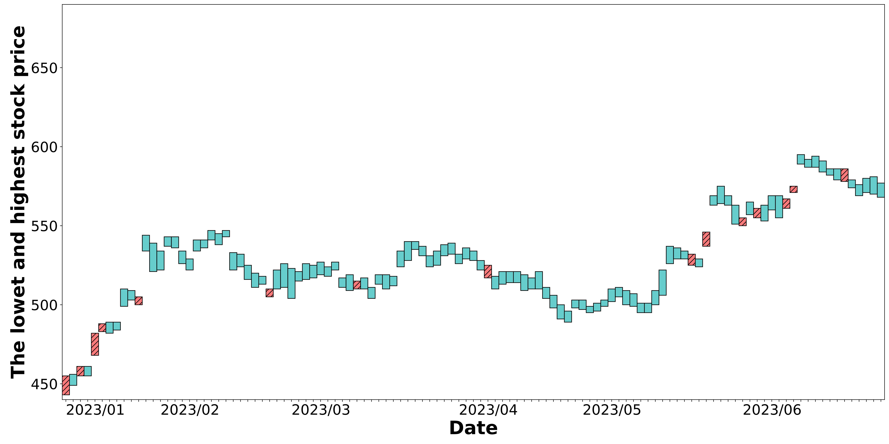

---
aliases:
---

# The Most and Longest Increasing Interval Subsequence Problem

This repository is the implement of the most increasing interval subsequence (MIIS) problem and the longest increasing interval subsequence (LIIS) problem.

## Build

## Usage

The input data is inserted by stdin.

```bash
./build/bin/IntervalSeq < ./test/simple/simple_1.txt
```

The test data should composed as bellow. Each line is an interval, and the starting value must be the firts one.

```
42 50
20 27
77 81
59 68
28 36
90 96
20 45
19 45
6 9
50 55
14 35
55 60
```

### Arguments

- MIIS with comparison by full interval
	- Default. Don't need any argument.

```bash
./build/bin/IntervalSeq
```

- MIIS with comparison by a subinterval
	- `-s / -sub`, and followed by and integer which represent the constant constraint $c$.

```bash
./build/bin/IntervalSeq -s 3
```

- LIIS with comparison by full interval

```bash
./build/bin/IntervalSeq -l
```

- LIIS with comparison by a subinterval

```bash
./build/bin/IntervalSeq -l -s
```

## Data

### Random

Generate randomized data by the `random.lua`. There should be four arguments. The First one is the input sequence length. The second one is the minimal starting value. The third one is the maximal ending value. The forth and fifth one represent the minimal and the maximal length, respectively.

```bash
lua ./test/random/random.lua 25 10 25 5 15
```

### Real-World

The stock price data is collected from [臺灣證卷交易所](https://www.twse.com.tw/zh/trading/historical/stock-day.html). We find the daily highest and lowest stock prices to form our interval sequence.

Below is a figure about the result of MIIS with comparison by full interval.


